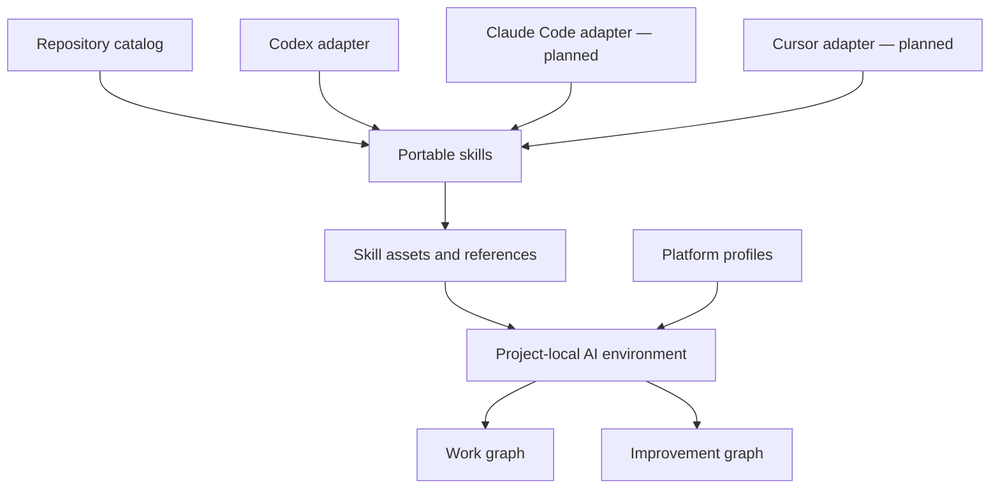

# Architecture

## Layers

### Portable core

`skills/` owns reusable procedures. A skill keeps essential instructions in `SKILL.md`, detailed contracts in `references/`, and generated project templates in `assets/`.

### Agent adapters

Agent-specific files distribute or present the portable core. The Codex adapter currently consists of `.codex-plugin/plugin.json` and optional `agents/openai.yaml` metadata inside skills. Future adapters must reference the same skill source rather than fork its behavior.

### Profiles

Profiles add platform-specific capabilities after the generic core is stable. They are overlays: an iOS profile may add Xcode and Simulator verification nodes, but it must not redefine product scope or generic completion evidence.

### Consumer projects

A consumer repository owns its product truth and the generated `.ai/` environment. This kit owns reusable setup logic and templates. Generated files may be adapted locally; improvements worth sharing should be proposed back to this repository as isolated, evaluated changes.

## Graph boundary

The generic blueprint documents work and improvement graphs but does not ship an autonomous agent runtime. Host agents continue to provide tools, approvals, sandboxing, and sessions. Deterministic graph validation can be added after the manual contracts have been exercised on real work.
