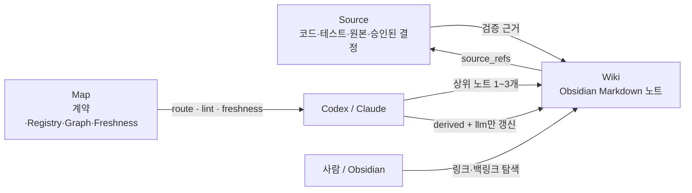

# llm-wiki-bootstrap example

`llm-wiki-bootstrap`은 흩어진 프로젝트 Markdown을 단순히 한 폴더로 모으는 대신, LLM이 근거를 찾아 읽고 제한된 범위에서 최신화할 수 있는 로컬 Wiki 환경을 구성합니다.

이 폴더는 사람이 결과를 이해하기 위한 예제입니다. 실제 설치 파일과 실행 도구는 [`skills/llm-wiki-bootstrap`](../../skills/llm-wiki-bootstrap)이 소유하며, 프로젝트별 노트 내용은 이 저장소에 포함하지 않습니다.

## 해결하려는 문제

- 문서와 `index.md`는 계속 늘어나지만 진입점이 수동으로 낡는다.
- 같은 주제가 여러 파일에 중복되고 어느 문서가 더 권위 있는지 알기 어렵다.
- Obsidian Graph가 연결을 보여줘도 LLM이 어떤 노트를 먼저 읽을지는 보장하지 않는다.
- 자동 갱신을 켜면 원본·결정·사람 작성 문서까지 덮어쓸 위험이 있다.

## 적용하는 해법

Graph는 주변 문서를 찾는 보조 수단입니다. 최종 권위는 `authority`, `status`, `source_refs`와 실제 Source 검증이 결정합니다.

## 두 개의 스킬 역할

- `$llm-wiki-bootstrap`: 환경을 초기화·도입·감사하는 배포용 스킬
- `$project-llm-wiki`: 설치된 프로젝트 안에서 매 요청마다 route·검증·durable delta 갱신을 수행하는 작은 runtime 스킬

## Read next

1. [생성되는 프로젝트 구조](project-structure.md)
2. [초기화·기존 Wiki 도입·감사 사용법](usage.md)
3. [공개와 자동 쓰기 안전 경계](safety-and-privacy.md)
