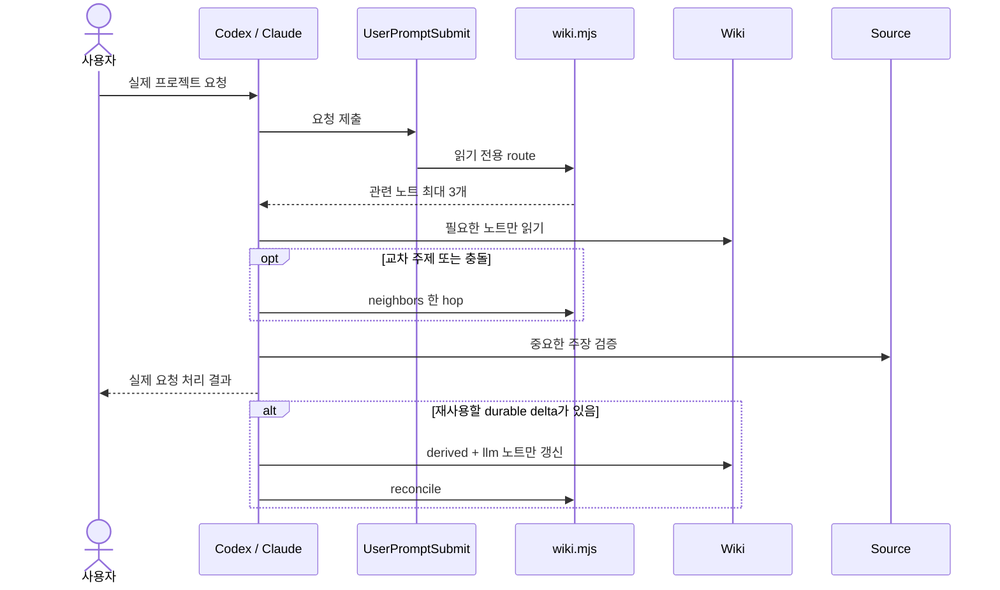

# 사용 예시

## 설치

대상 프로젝트에서 Codex에 요청합니다.

```text
Install llm-wiki-bootstrap from
https://github.com/kim946509/ai-engineering-kit/tree/main/skills/llm-wiki-bootstrap
into this project's .agents/skills directory.
```

## 새 프로젝트 초기화

```text
Use $llm-wiki-bootstrap to initialize a local LLM Wiki for this project.
Enable Codex and Claude Code adapters, keep the existing Git boundary,
and use Obsidian only as an optional human navigation surface.
```

스킬이 내부적으로 사용하는 결정적 scaffold 명령은 다음 형태입니다.

```text
python scripts/bootstrap_wiki.py install --target <project-root> --project-name "Example" --providers codex,claude --obsidian
```

작업공간 루트에 Git이 없고 Wiki 이력만 로컬에 남기려면 사용자가 명시적으로 요청한 뒤 `--git-mode nested-local`을 추가합니다.

## 기존 문서 또는 Wiki 도입

```text
Use $llm-wiki-bootstrap in adopt mode. Preserve every existing note,
agent rule, provider hook, and Git boundary. Audit first, then merge only
the missing Source/Wiki/Map contracts and show me all protected conflicts.
```

기존 `docs/wiki`가 있으면 설치기는 의도적으로 중단합니다. 먼저 다음 읽기 전용 감사를 사용합니다.

```text
python scripts/bootstrap_wiki.py audit --target <project-root> --providers codex,claude --json
```

## 일상적인 요청 흐름



`Provider` 단계가 실제 요청을 계획하고 답하거나 코드를 변경하는 단계입니다. Hook과 Wiki 조회는 그 앞단의 bounded context 준비이며, 문서 전용 요청에서만 실행되는 별도 루프가 아닙니다.

## Obsidian

프로젝트 루트를 Vault로 열고 새 노트 위치를 `docs/wiki`, 첨부 위치를 `docs/wiki/assets`로 설정합니다. Graph는 `docs/wiki` 중심으로 필터링하되, LLM은 Obsidian 내부 데이터베이스가 아니라 같은 Markdown 파일과 공용 CLI를 사용합니다.
