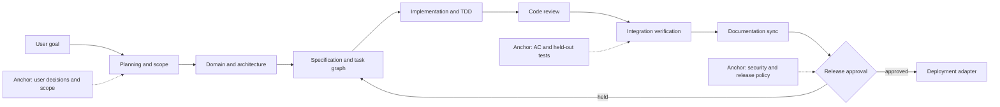
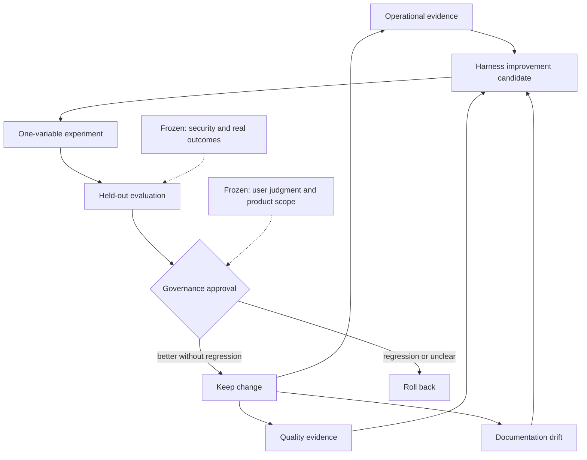

# Work and Improvement Graphs

Graph Engineering connects feedback loops with explicit authority, cadence, evidence, and frozen anchors. It is more than a diagram of task order.

## Work graph

Every active node has inputs, outputs, owner, acceptance criteria, evidence, and terminal states. Parallelize only independent work that does not compete for the same mutable surface.

## Improvement graph

## Ownership and cadence

| Loop | Default owner | Cadence | Optimization metric | Counter-metric | Anchor or veto |
|---|---|---|---|---|---|
| Planning | Human product owner | Before a feature | Specification completeness | Scope growth | Product sources and explicit decisions |
| Implementation | Development agent | Per work item | AC pass rate | Regressions and change size | Tests and architecture rules |
| Review | Independent review perspective | Per change | Valid defects found | False positives and needless refactors | Original specification and diff |
| Documentation | Implementer | When behavior changes | Code-doc consistency | Documentation volume | Actual behavior and ADRs |
| Release | Human operator | Per release | Deployment success | Incidents and rollback | Human approval and operating checks |
| Harness improvement | Human governor | After repeated failure | Held-out success rate | Cost, time, and regressions | Frozen evaluation and rollback |

Replace default owners and metrics with project-specific values. Fast loops must not redefine targets owned by slower or human-governed loops.
