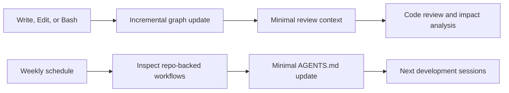

# Code Review Graph Extension

Code Review Graph를 코드 리뷰 루프의 관찰자로 연결하고, 저장소에서 새로 확인된 운영 지식을 `AGENTS.md`에 주기적으로 반영하는 선택적 extension입니다.

이 extension은 두 개의 서로 다른 피드백 루프를 묶습니다.



## Loop 1: code graph freshness

- Run one full graph build after installation.
- After file-changing tool calls, run an incremental update with `--skip-flows` for low latency.
- Check graph status when a session starts or resumes.
- Start graph-assisted work with minimal context and request deeper analysis only when needed.
- Treat graph output as review evidence, not as a replacement for source inspection, tests, builds, or the original specification.

The Codex hook template is at `assets/extensions/code-review-graph/codex/hooks.json`. It matches the currently exercised pattern:

- `PostToolUse(Write|Edit|Bash)` → `code-review-graph update --skip-flows`
- `SessionStart(startup|resume)` → `code-review-graph status`

Officially supported alternatives are a long-running `code-review-graph watch` process or post-tool hooks. Choose one update mechanism; running both produces duplicate work.

## Loop 2: AGENTS.md maintenance

The Codex automation template at `assets/extensions/code-review-graph/codex/automations/update-agents-md.template.toml` runs weekly and asks an isolated worktree task to update only repository-backed workflows and commands.

Guardrails:

- Make small, evidence-backed documentation changes.
- Do not rewrite product policy, acceptance criteria, security rules, or unrelated sections.
- Do not invent commands. Add a short TODO when evidence is insufficient.
- Do not commit or push automatically.
- Review the resulting diff before adopting it.

This is a documentation-governance loop, not a Code Review Graph feature. Its slower cadence prevents the fast implementation loop from rewriting agent policy after every task.

## Activation

1. Install and initialize Code Review Graph using its current official instructions.

   ```text
   pip install code-review-graph
   code-review-graph install
   code-review-graph build
   ```

2. Add `.code-review-graph/` to the target repository's ignore file.
3. Merge `assets/extensions/code-review-graph/templates/AGENTS.snippet.md` into the target project rules.
4. For Codex, merge `assets/extensions/code-review-graph/codex/hooks.json` with existing hooks; do not overwrite unrelated hooks.
5. Create the weekly automation using the Codex automation UI/tool and the values in the TOML template. Replace all placeholders with the real target project, root, and available model.
6. Verify graph status, perform one code change, and confirm an incremental update succeeds.

## Metrics and counter-metrics

| Loop | Metric | Counter-metric | Owner/cadence |
|---|---|---|---|
| Graph freshness | Changed files reflected in graph | Update latency and duplicate runs | Development loop / after changes |
| Review context | Relevant impacted flows found | False positives and missed tests | Review loop / per review |
| AGENTS maintenance | Verified workflows documented | Churn, invented commands, policy drift | Documentation governance / weekly |

Runtime graph data stays local and untracked. Only reusable configuration, documentation, and evidence-backed project rules belong in Git.
